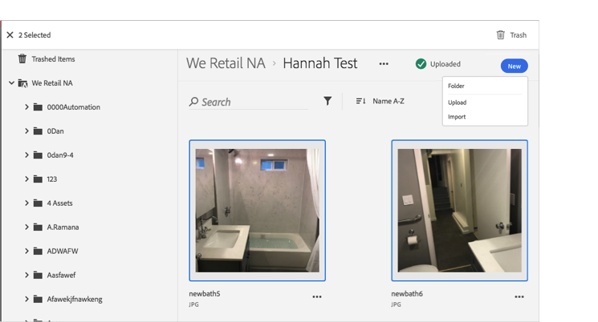

# Enviar a la papelera un recurso{#trash-an-asset}

Puede enviar a la papelera un recurso de la biblioteca de Adobe Experience Cloud para quitarlo de la misma biblioteca.

Para enviar a la papelera un recurso en la biblioteca de Experience Cloud:

1. Haga clic en uno o más recursos para enviarlos a la papelera. 

1. Haga clic en el icono **[!UICONTROL Papelera]** en la parte superior de la página.

