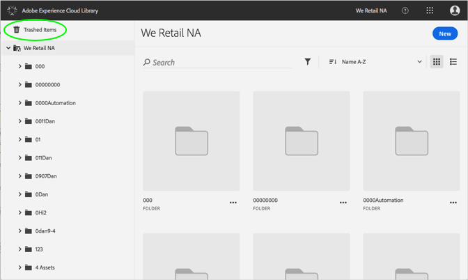
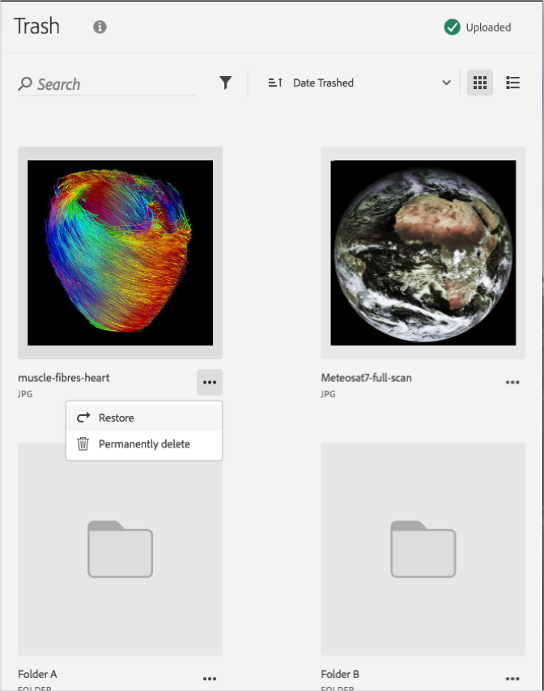

# Eliminar permanentemente un recurso extraído{#permanently-delete-a-trashed-asset}

Puede eliminar permanentemente un recurso de papelera en la biblioteca de Adobe Experience Cloud.

Cuando se papelera un elemento, éste reside en el área Elementos trascadenados de la biblioteca de Experience Cloud durante 60 días. Si no restaura elementos, la biblioteca de Experience Cloud los elimina de forma permanente pasados 60 días.

Puede eliminar permanentemente un recurso transferido antes de que transcurra 60 días por:

1. Haga clic en **[!UICONTROL Elementos móviles]**.

   

1. Haga clic en uno o varios elementos para eliminar de forma permanente.
1. Haga clic en **[!UICONTROL Más información &gt; Eliminar permanentemente]**.

   

1. Confirme que desea eliminar permanentemente los recursos seleccionados.

