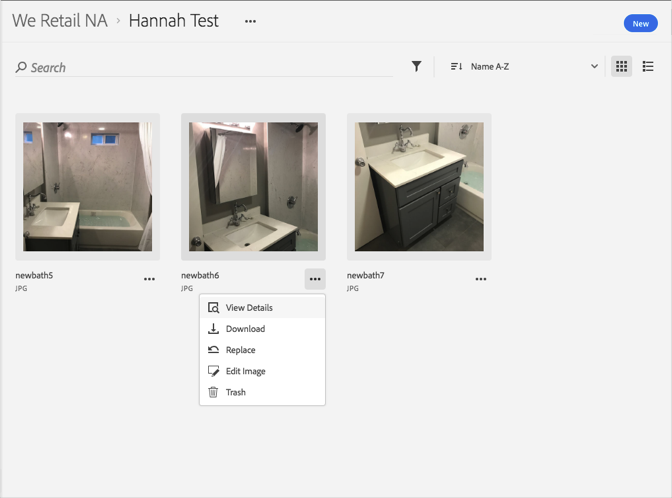

# Descargar un recurso{#download-an-asset}

Puede descargar un recurso en la biblioteca de Adobe Experience Cloud.

1. Haga clic en un recurso.
1. Haga clic en el menú **[!UICONTROL Más opciones]** (elipsis) que está junto al recurso.

   

1. Haga clic en **[!UICONTROL Descargar]** para descargar el recurso.

