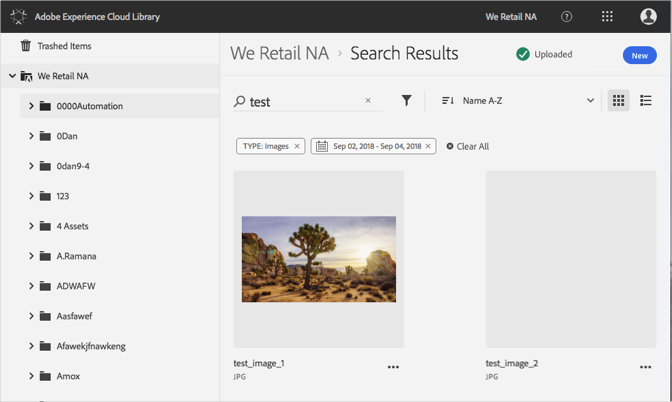

# Buscar recursos{#search-for-assets}

Busque recursos en la biblioteca de Adobe Experience Cloud para buscar recursos en la organización o en una carpeta específica.

Busque recursos en la biblioteca de Experience Cloud mediante la barra de búsqueda. La búsqueda busca los nombres de archivos.

