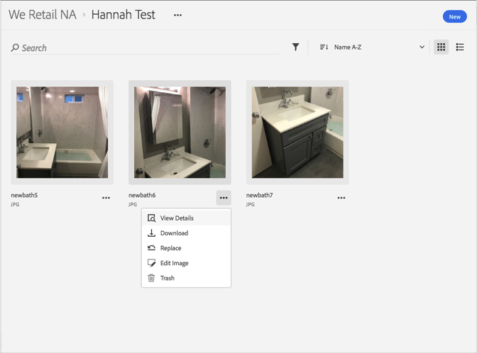
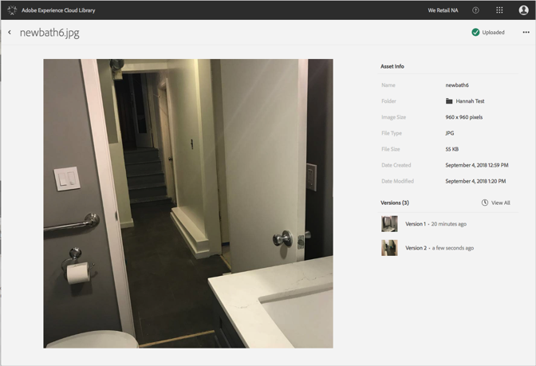

# Ver información detallada de un recurso{#view-detailed-information-for-an-asset}

Consulte información detallada sobre los recursos y sus versiones en la biblioteca de Adobe Experience Cloud.

Para ver información detallada sobre los recursos y sus versiones en la biblioteca de Experience Cloud:

1. Haga clic en un recurso.
1. Haga clic en el menú **[!UICONTROL Más opciones]** (elipsis) que está junto al recurso.

   

1. Haga clic en **[!UICONTROL Ver detalles]** para ver más detalles de un recurso.

   

