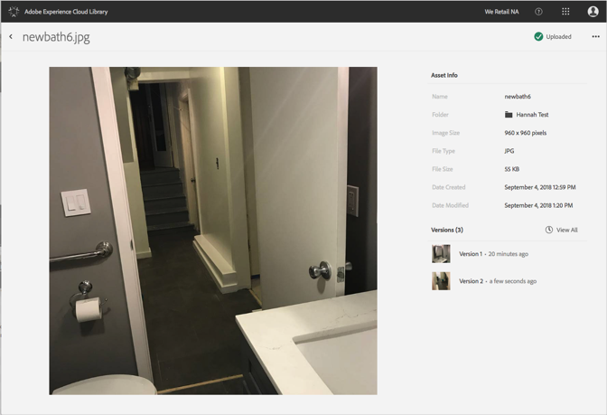

# Ver versiones anteriores de un recurso{#view-previous-versions-of-an-asset}

Puede ver versiones anteriores de un recurso en la biblioteca de Adobe Experience Cloud.

Para ver versiones anteriores de un recurso en la biblioteca de Experience Cloud:

1. Seleccione un recurso.
1. Seleccione el **[!UICONTROL menú Más opciones]** (elipsis) junto al recurso.

   

1. Seleccione **[!UICONTROL Detalles del recurso]**.
1. Seleccione **[!UICONTROL Ver todo]** junto a Versiones para ver todas las versiones del recurso.

   

