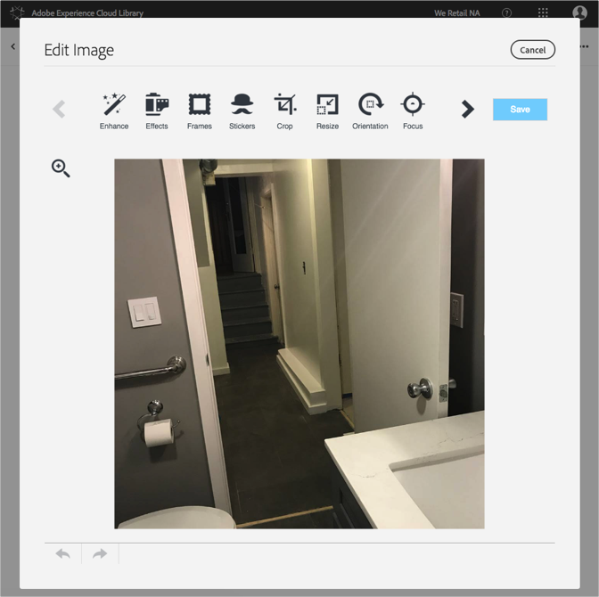

# Editar una imagen{#edit-an-image}

Utilice el editor de imágenes básico integrado en la biblioteca de Adobe Experience Cloud para editar una imagen sobre la marcha directamente desde la biblioteca.

Para editar una imagen desde la biblioteca de Experience Cloud:

1. Haga clic en una imagen para editarla.
1. Haga clic en Editar imagen. Al guardar la imagen, se guardará como una versión nueva.

   El editor de imágenes se abre y puede editar la imagen.

   

