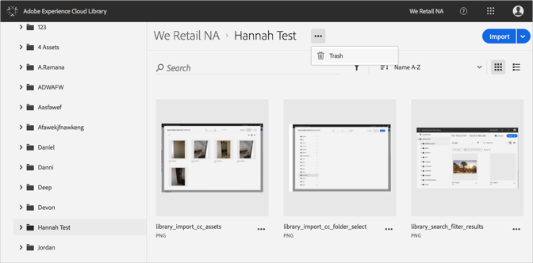
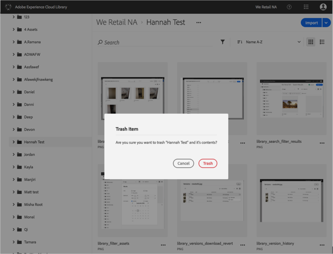

# Enviar a la papelera una carpeta{#trash-a-folder}

Puede enviar a la papelera una carpeta de la biblioteca de Adobe Experience Cloud.

Para enviar a la papelera una carpeta en la biblioteca de Experience Cloud:

1. Haga clic en la carpeta para enviarla a la papelera.
1. Haga clic en el menú **[!UICONTROL Más opciones]** (elipsis) y seleccione **[!UICONTROL Papelera]**.

   

1. Confirme que quiere llevar la carpeta a la papelera.

   

