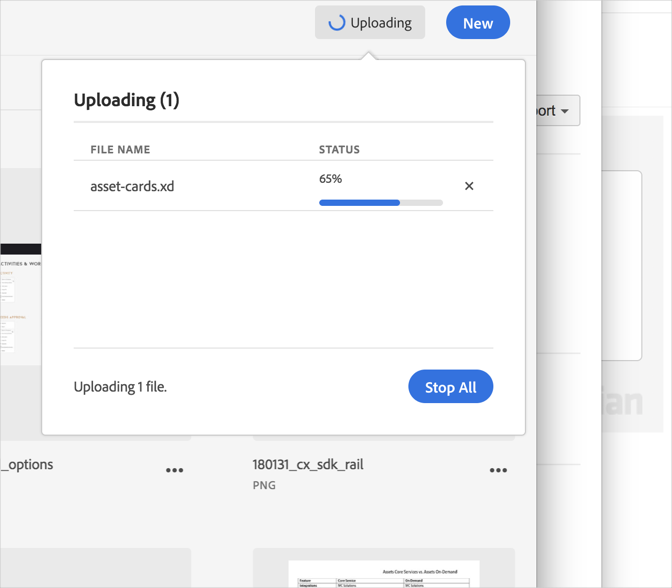

# Cancelar una carga{#cancel-an-upload}

Cancele una carga del dispositivo a la biblioteca de Adobe Experience Cloud si ha seleccionado un archivo incorrecto o que es demasiado grande.

Para cancelar una carga que ya se haya iniciado:

1. Haga clic en el indicador de notificaciones.
1. Haga clic en **[!UICONTROL Detener todo]** para detener todas las descargas, o haga clic en la **[!UICONTROL X]** que está junto a los archivos individuales que quiere cancelar.

   

Si selecciona uno o varios archivos con el mismo nombre, la biblioteca de Experience Cloud le indicará que sustituya las versiones anteriores o que conserve las nuevas.
