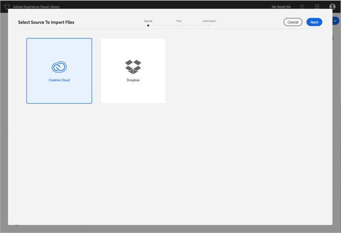
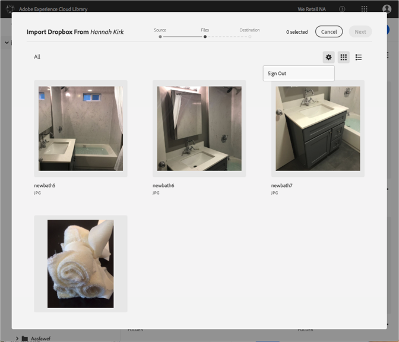

# Cambiar dropbox o cuentas de Creative Cloud{#change-dropbox-or-creative-cloud-accounts}

Cambie a una cuenta de Dropbox o Creative Cloud diferente para añadir contenido a la biblioteca de Adobe Experience Cloud.

Una vez que inicie sesión en una cuenta de Dropbox o Creative Cloud, permanecerá iniciada sesión a menos que cierre sesión o cambie cuentas.

Para cambiar a una cuenta de Dropbox o Creative Cloud diferente:

1. Seleccione **[!UICONTROL Nuevo]** &gt; **[!UICONTROL Importar]**.

   

1. Seleccione **[!UICONTROL Creative Cloud]** o **[!UICONTROL Dropbox]**.

   

1. Seleccione **[!UICONTROL Siguiente]**.
1. Seleccione el icono de engranaje en la esquina superior derecha.

   

1. Seleccione **[!UICONTROL Cerrar sesión]**.
1. Inicie sesión en la otra cuenta.

