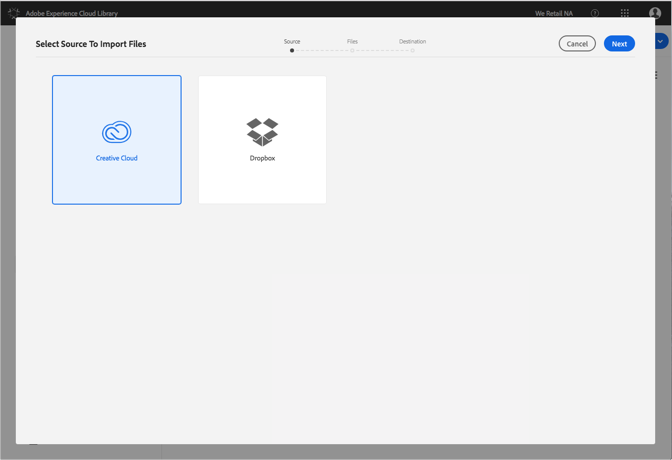

# Importar archivos de Creative Cloud en la biblioteca de Adobe Experience Cloud{#import-creative-cloud-files-into-the-adobe-experience-cloud-library}

Importe archivos de Creative Cloud a la biblioteca de Adobe Experience Cloud para administrarlos desde cualquier producto de Adobe Experience Cloud.

>[!NOTE]
>
>Debe crear una carpeta para poder realizar esta tarea.

Para importar archivos de Creative Cloud en la biblioteca de Experience Cloud:

1. Seleccionar **[!UICONTROL Nuevo]** > **[!UICONTROL Importar]**.

   

1. Seleccione **[!UICONTROL Creative Cloud]**.

   Inicie sesión en su cuenta de Creative Cloud, si aún no lo ha hecho.

   

1. Haga clic en **[!UICONTROL Siguiente]**.
1. Seleccione uno o varios archivos para importar.

   

1. Haga clic en **[!UICONTROL Siguiente]**.
1. Seleccione la carpeta en la que quiere colocar los recursos.

   >[!NOTE]
   >
   >Puede elegir una carpeta en la que importar los recursos. Para colocar archivos en diferentes carpetas, repita esta tarea con cada carpeta.

   

1. Haga clic en **[!UICONTROL Importar]**.

