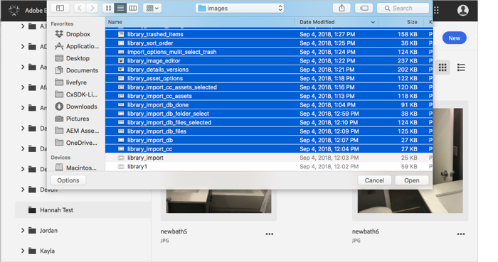
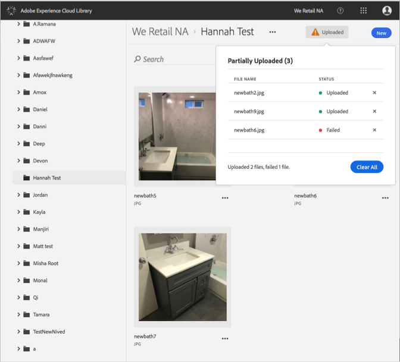

# Cargar recurso desde dispositivo{#upload-asset-from-device}

Cargue recursos desde su dispositivo para administrarlos en la biblioteca de Adobe Experience Cloud.

Para cargar recursos desde el dispositivo a la biblioteca de Experience Cloud:

1. Seleccione **[!UICONTROL Nuevo]** &gt; **[!UICONTROL Cargar]**.

   

1. Seleccione los recursos que desea cargar en la biblioteca de Experience Cloud.

   

1. Cuando los archivos hayan competido, se mostrará una confirmación o cualquier mensaje de error en el cuadro de notificación.

   

